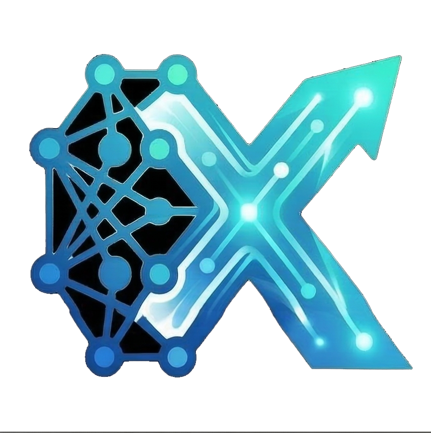
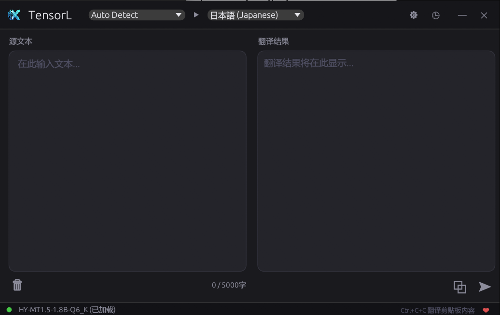

<div align="center">

#  TensorL

**本地离线 LLM 翻译工具 — 隐私至上，无需联网**

[](https://www.rust-lang.org/)
[](https://www.microsoft.com/windows)
[](#license)
[](https://github.com/ggerganov/llama.cpp)
[](https://www.modelscope.cn/models/Tencent-Hunyuan/HY-MT1.5-1.8B-GGUF/files)



</div>

---

## 简介

TensorL 是一款基于本地大语言模型的 Windows 翻译工具。采用腾讯混元翻译模型 **HY-MT1.5-1.8B**（GGUF 格式），通过 llama.cpp 进行推理，所有数据完全在本地处理，无需联网，保护您的隐私。

---

## 功能特性

| 特性 | 说明 |
|:---|:---|
| **离线翻译** | 所有推理在本地完成，无需网络连接，数据不出设备 |
| **全局热键** | `Ctrl+C+C` — 选中文本后快速连按两次 Ctrl+C 即可翻译剪贴板内容 |
| **精美暗色 UI** | 无边框窗口，基于 egui 的现代深色主题界面 |
| **流式输出** | 实时逐 token 显示翻译结果，附带推理速度（tokens/s）显示 |
| **多语言支持** | 支持 30+ 种语言互译，源语言可自动检测 |
| **CPU / GPU 推理** | 支持纯 CPU 推理，亦支持 CUDA 和 Vulkan GPU 加速 |
| **翻译历史** | 自动保存翻译记录，方便回顾查阅 |
| **可配置参数** | 可调整线程数、上下文大小、GPU 层数等推理参数 |
| **字符限制** | 单次翻译最多 5000 字符 |
| **系统托盘** | 最小化至系统托盘，不占用任务栏空间 |

---

## 系统要求

| 项目 | 最低要求 |
|:---|:---|
| **操作系统** | Windows 10/11 (x86_64) |
| **内存** | 4 GB 以上（推荐 8 GB） |
| **磁盘空间** | 约 2 GB（模型文件 + 程序） |
| **Rust 工具链** | Rust 1.75+ 及 C/C++ 编译器（MSVC 或 MinGW） |
| **GPU（可选）** | NVIDIA GPU + CUDA Toolkit，或支持 Vulkan 的 GPU |

---


## 使用指南

### 翻译操作

1. **直接输入** — 在左侧输入框中粘贴或输入待翻译的文本，点击翻译按钮
2. **全局热键** — 在任意应用中选中文本，按 `Ctrl+C`，然后在 500ms 内再按一次 `Ctrl+C`，TensorL 将自动翻译剪贴板内容

### 语言选择

- **源语言**：支持「自动检测」模式，也可手动指定
- **目标语言**：从支持的语言列表中选择

### 翻译历史

点击界面中的历史按钮可查看之前的翻译记录，点击任意条目可快速回顾。

### 设置面板

| 参数 | 说明 | 默认值 |
|:---|:---|:---|
| 模型路径 | `.gguf` 模型文件的路径 | — |
| 推理后端 | CPU 或 GPU (CUDA/Vulkan) | CPU |
| GPU 层数 | 卸载到 GPU 的模型层数 | 99（全部） |
| 上下文大小 | 推理上下文 token 数 | 2048 |
| CPU 线程数 | 推理使用的线程数 | CPU 核心数 / 2 |

---

## 构建选项

TensorL 通过 Cargo features 支持不同的推理后端：

```bash
# CPU 模式（默认）
cargo build --release

# NVIDIA CUDA GPU 加速
cargo build --release --features cuda

# Vulkan GPU 加速
cargo build --release --features vulkan
```

> **注意：** 使用 `cuda` feature 需要预先安装 CUDA Toolkit；使用 `vulkan` feature 需要安装 Vulkan SDK。

---

## 支持的语言

TensorL 支持以下 30+ 种语言的互译：

| 语言 | 标识 | 语言 | 标识 |
|:---|:---|:---|:---|
| 中文 | Chinese | 英语 | English |
| 法语 | Francais | 葡萄牙语 | Portugues |
| 西班牙语 | Espanol | 日语 | Japanese |
| 土耳其语 | Turkish | 俄语 | Russian |
| 阿拉伯语 | Arabic | 韩语 | Korean |
| 泰语 | Thai | 意大利语 | Italian |
| 德语 | German | 越南语 | Vietnamese |
| 马来语 | Malay | 印尼语 | Indonesian |
| 菲律宾语 | Filipino | 印地语 | Hindi |
| 繁体中文 | Traditional Chinese | 波兰语 | Polish |
| 捷克语 | Czech | 荷兰语 | Dutch |
| 高棉语 | Khmer | 缅甸语 | Burmese |
| 波斯语 | Persian | 古吉拉特语 | Gujarati |
| 乌尔都语 | Urdu | 泰卢固语 | Telugu |
| 马拉地语 | Marathi | 希伯来语 | Hebrew |
| 孟加拉语 | Bengali | 泰米尔语 | Tamil |
| 乌克兰语 | Ukrainian | 藏语 | Tibetan |
| 哈萨克语 | Kazakh | 蒙古语 | Mongolian |
| 维吾尔语 | Uyghur | 粤语 | Cantonese |

---

## 技术架构

```
TensorL
├── src/
│   ├── main.rs          # 入口：窗口初始化、线程启动
│   ├── app.rs           # egui 界面：翻译面板、设置、历史
│   ├── translator.rs    # 推理线程：模型加载、token 生成
│   ├── hotkey.rs        # 全局热键：Win32 低级键盘钩子
│   └── config.rs        # 配置：语言定义、序列化、持久化
├── assets/
│   └── icon.png         # 应用图标
├── build.rs             # Windows 资源嵌入
└── Cargo.toml           # 依赖与 features 配置
```

**核心依赖：**

| 库 | 用途 |
|:---|:---|
| `llama-cpp-2` | GGUF 模型推理（llama.cpp Rust 绑定） |
| `eframe` / `egui` | 跨平台即时模式 GUI 框架 |
| `arboard` | 跨平台剪贴板读写 |
| `tray-icon` | 系统托盘图标 |
| `rfd` | 原生文件选择对话框 |
| `windows` | Win32 API 访问（键盘钩子、窗口管理） |

---

## 隐私声明

TensorL 的核心设计理念是 **隐私至上**：

- 所有翻译由本地模型完成，**无任何网络请求**
- 不收集、不上传任何用户数据
- 配置文件仅保存在本地 `%APPDATA%/TensorL/config.json`
- 翻译历史仅存储在内存中，关闭应用即清除

---

## License

本项目采用双许可证发布，您可任选其一：

- [MIT License](https://opensource.org/licenses/MIT)
- [Apache License 2.0](https://opensource.org/licenses/Apache-2.0)

---

## 致谢

- [**腾讯混元翻译团队**](https://www.modelscope.cn/models/Tencent-Hunyuan/HY-MT1.5-1.8B-GGUF) — HY-MT1.5-1.8B 翻译模型
- [**llama.cpp**](https://github.com/ggerganov/llama.cpp) — 高性能 GGUF 模型推理引擎
- [**egui**](https://github.com/emilk/egui) — Rust 即时模式 GUI 框架
- [**llama-cpp-2**](https://crates.io/crates/llama-cpp-2) — llama.cpp 的 Rust 绑定

---

<div align="center">

**TensorL** — 让翻译回归本地，让隐私不再妥协。

</div>
